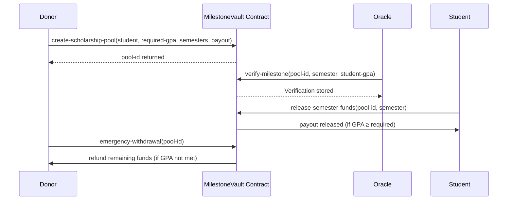

# MilestoneVault

### Trustless Milestone-Driven Educational Fund Distribution Protocol

MilestoneVault is a **decentralized scholarship management system** built on Stacks (Bitcoin L2). It enables **donors** to establish conditional funding pools that **automatically disburse educational grants** when **students achieve verified academic milestones**.

By leveraging **Bitcoin’s security** and **Clarity smart contracts**, MilestoneVault ensures:

* Transparent and tamper-proof allocation of scholarship funds
* Automated milestone verification through authorized oracles
* Secure, trustless disbursement of semester-based educational grants

---

## 📖 System Overview

MilestoneVault introduces a **conditional milestone-driven fund release model**:

1. **Donors** create scholarship pools by locking funds in the contract.
2. Each pool specifies:

   * A **student recipient**
   * A **required GPA threshold**
   * A fixed **number of semesters**
   * A **payout amount per semester**
3. **Oracles** (authorized verifiers) submit academic performance data each semester.
4. If the student meets or exceeds the required GPA:

   * Funds for that semester are **released automatically**.
5. If milestones are not met (or verification is missing):

   * Donors may invoke an **emergency withdrawal** to reclaim unused funds.

This structure ensures funds are used **only when academic performance is proven**, aligning donor intentions with verifiable student outcomes.

---

## ⚙️ Contract Architecture

The protocol is implemented as a **single Clarity smart contract** with three main registries and multiple helper functions.

### **State Variables**

* `pool-counter` → Auto-incremented counter for scholarship pool IDs

### **Data Maps**

1. **Oracles Registry** (`oracles`)

   * Stores a list of authorized verifiers (universities, institutions, or accredited bodies).

2. **Scholarship Pools** (`scholarship-pools`)

   * Core structure of each funding pool, including donor, student, GPA requirement, semester details, and fund balances.

3. **Milestone Verifications** (`milestone-verifications`)

   * Records per-semester GPA submissions by oracles, timestamped and validated.

---

### **Core Functions**

#### 🔑 Oracle Management

* `add-oracle` / `remove-oracle` → Contract owner manages authorized verifiers.

#### 🎓 Scholarship Pool Lifecycle

* `create-scholarship-pool` → Donor locks funds and creates a new milestone-driven pool.
* `verify-milestone` → Oracle submits student GPA for a specific semester.
* `release-semester-funds` → Student receives payout if GPA milestone is achieved.
* `emergency-withdrawal` → Donor reclaims remaining funds if GPA requirements are not met.

#### 📡 Read-Only Helpers

* `is-oracle` → Check if a principal is an authorized oracle.
* `get-pool-info` → Fetch full details of a scholarship pool.
* `get-milestone-verification` → Retrieve verification for a specific semester.
* `get-contract-info` → Metadata about the contract.

---

## 🔄 Data Flow

Below is a simplified flow of interactions between **Donors**, **Students**, and **Oracles**:



---

## ✅ Key Features

* **Trustless disbursement** → No intermediaries required.
* **Oracle-based verification** → Independent authorized parties validate milestones.
* **Milestone-driven** → Funds tied to performance, not just time.
* **Emergency donor protection** → Refund mechanism ensures unused funds are safe.
* **Transparent auditability** → All state is public and queryable on-chain.

---

## 🚀 Deployment & Usage

1. **Deploy Contract**

   * Deploy the contract on the Stacks blockchain.
   * Contract owner initializes oracle registry.

2. **Create a Scholarship Pool** (Donor)

   ```clarity
   (contract-call? .milestone-vault create-scholarship-pool 
      'STUDENT-ADDRESS u350 u8 u1000)
   ```

   → Creates a pool requiring **GPA ≥ 3.5 (350)** across **8 semesters**, paying **1,000 STX per semester**.

3. **Submit Milestone Verification** (Oracle)

   ```clarity
   (contract-call? .milestone-vault verify-milestone u1 u1 u360)
   ```

   → Submits GPA = 3.6 for semester 1 in pool ID `1`.

4. **Release Semester Funds** (Student)

   ```clarity
   (contract-call? .milestone-vault release-semester-funds u1 u1)
   ```

   → Student claims payout for semester 1 after successful GPA verification.

5. **Emergency Withdrawal** (Donor)

   ```clarity
   (contract-call? .milestone-vault emergency-withdrawal u1)
   ```

   → Donor withdraws remaining funds if GPA requirement not met.

---

## 🔐 Security Considerations

* **Oracle trust model** → Only contract-owner-authorized oracles can verify milestones.
* **Replay protection** → Each semester must be released sequentially.
* **Donor safeguards** → Emergency withdrawal ensures no indefinite lock-in.
* **Tamper-proof GPA records** → Stored immutably with verifier address and timestamp.

---

## 📜 Contract Metadata

```clarity
(get-contract-info)
;; {
;;   name: "MilestoneVault",
;;   version: "1.0.0",
;;   description: "Trustless milestone-driven educational fund distribution protocol"
;; }
```

---

## 🏗️ Future Extensions

* Multi-donor pooled scholarships
* Support for multiple milestone types beyond GPA
* Reputation-weighted oracle system
* Integration with decentralized identity for student verification
